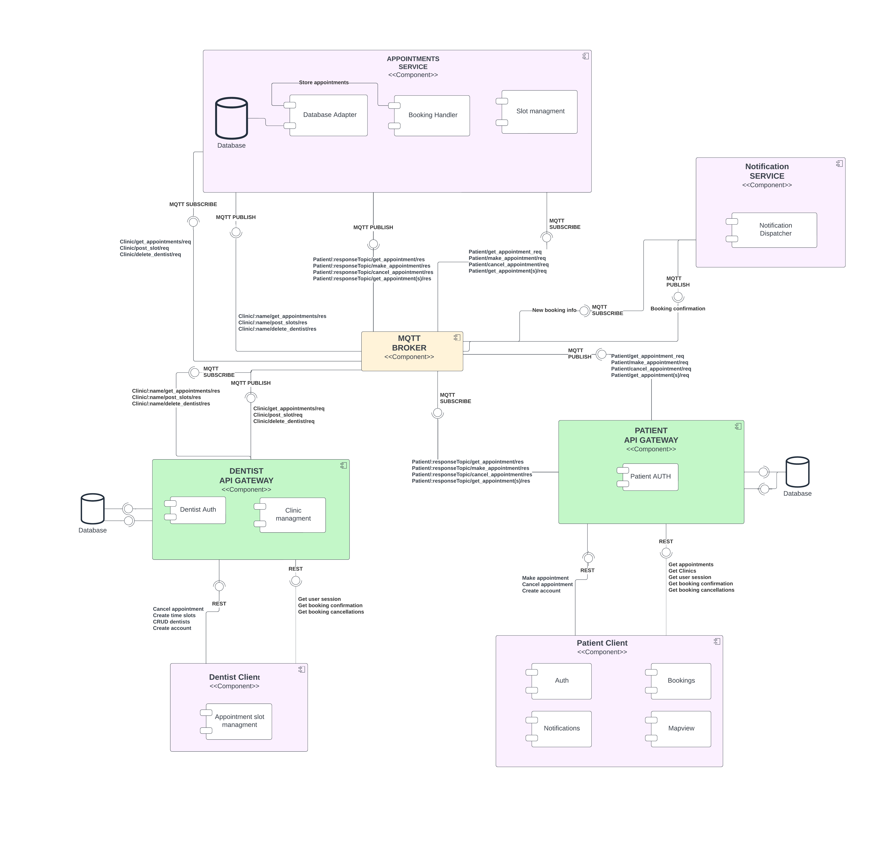

## Dentist-appointment service
This project was done as part of the Miniproject:distributed-systems course, this appointment booking system is consist of a dentist client, a patient client, an AppointmentService,
a dentist-API & patient-API and a notification service in addition of a MQTT broker as a communication bridge between services.
## System Architecture 

