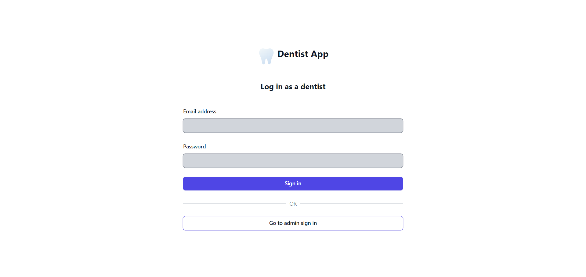
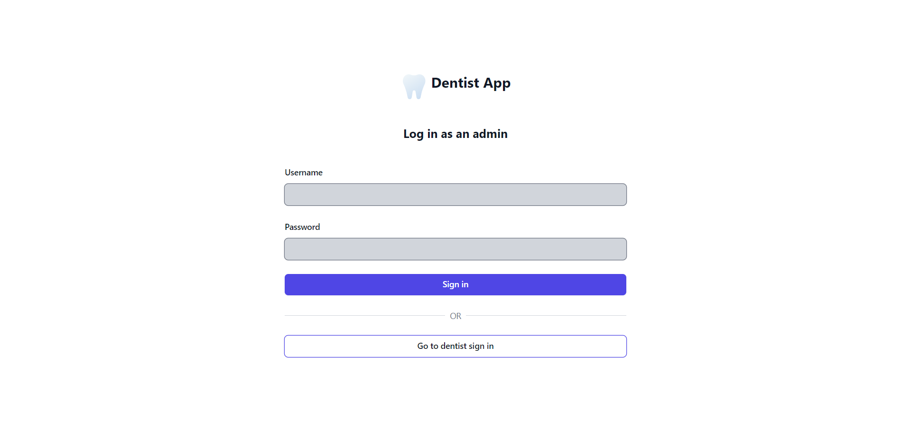
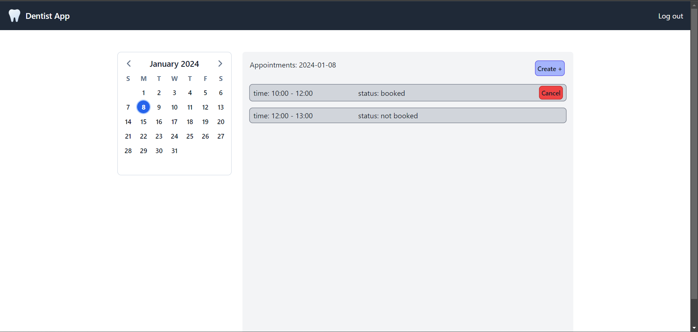
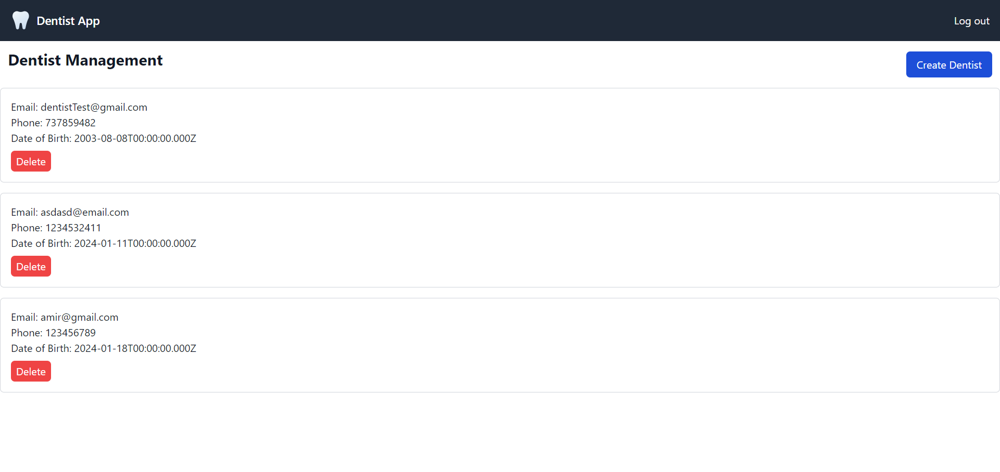
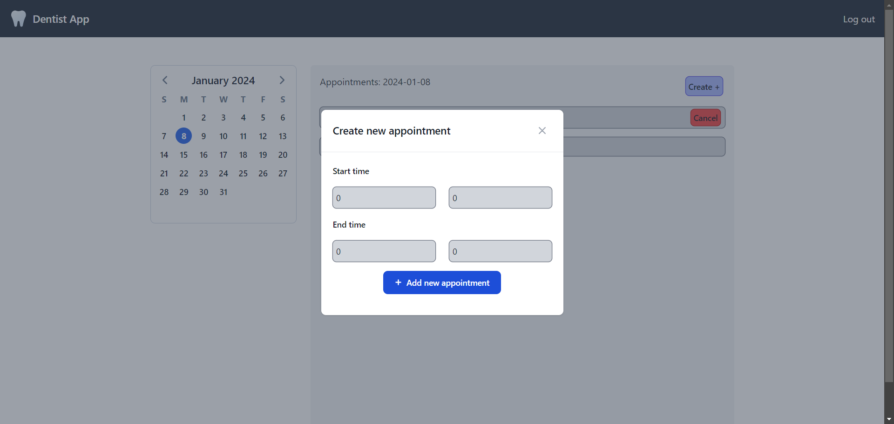
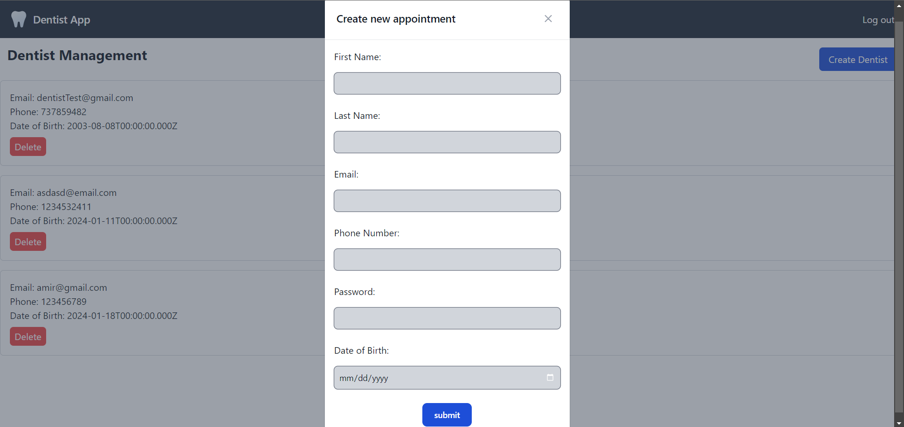

# Dentist Booking System frontend

Welcome to our Frontend Dentist Booking System, a groundbreaking and user-friendly application crafted to facilitate efficient management of dental appointments throughout Sweden.

## Description

This serves as the user interface for a dental appointment booking system. Administrators can access clinics to include or remove dentists from their respective clinics. Additionally, dentists have the ability to log in and oversee their appointment schedule, allowing them to add new appointments or cancel existing ones.

## Interface and features

|             Dentist login              |              Admin login             |
| :------------------------------------: | :----------------------------------: |
|  |  |

|             Apponintment Page             |             Clinic page              |
| :---------------------------------------: | :----------------------------------: |
|  |  |

|             Create apponintment             |               Add dentist               |
| :-----------------------------------------: | :-------------------------------------: |
|  |  |


## Technologies used

- Vite
- Vue
- Typescript
- Tailwind CSS
- Vue-router


### Installation guide

### 1. Set up each of the microservices and gateways

See information in the README.md files in each of the microservices and gateways.

### 2. Set up the frontend

```bash
git clone 'repo link'
cd 'repo name
npm install
npm run dev
```
